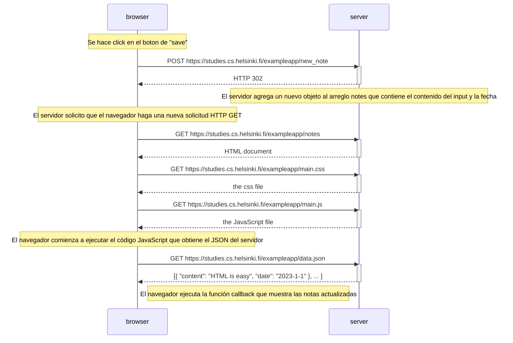

```mermaid
sequenceDiagram
    participant browser
    participant server

    Note over browser: Se hace click en el boton de "save"

    browser->>server: POST https://studies.cs.helsinki.fi/exampleapp/new_note
    activate server
    server-->>browser: HTTP 302
    deactivate server
    Note over server: El servidor agrega un nuevo objeto al arreglo notes que contiene el contenido del input y la fecha

    Note over browser: El servidor solicito que el navegador haga una nueva solicitud HTTP GET

    browser->>server: GET https://studies.cs.helsinki.fi/exampleapp/notes
    activate server
    server-->>browser: HTML document
    deactivate server

    browser->>server: GET https://studies.cs.helsinki.fi/exampleapp/main.css
    activate server
    server-->>browser: the css file
    deactivate server

    browser->>server: GET https://studies.cs.helsinki.fi/exampleapp/main.js
    activate server
    server-->>browser: the JavaScript file
    deactivate server

    Note over browser: El navegador comienza a ejecutar el código JavaScript que obtiene el JSON del servidor

    browser->>server: GET https://studies.cs.helsinki.fi/exampleapp/data.json
    activate server
    server-->>browser: [{ "content": "HTML is easy", "date": "2023-1-1" }, ... ]
    deactivate server

    Note right of browser: El navegador ejecuta la función callback que muestra las notas actualizadas
```
