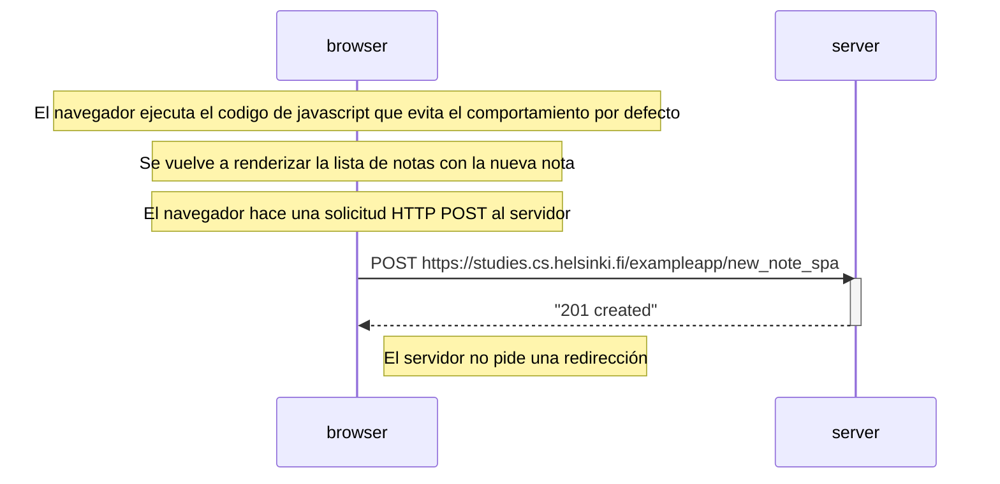

```mermaid
sequenceDiagram
    participant browser
    participant server

    Note over browser: El navegador ejecuta el codigo de javascript que evita el comportamiento por defecto

    Note over browser: Se vuelve a renderizar la lista de notas con la nueva nota

    Note over browser: El navegador hace una solicitud HTTP POST al servidor


    browser->>server: POST https://studies.cs.helsinki.fi/exampleapp/new_note_spa
    activate server
    server-->>browser: "201 created"
    deactivate server

    Note right of browser: El servidor no pide una redirección
```
